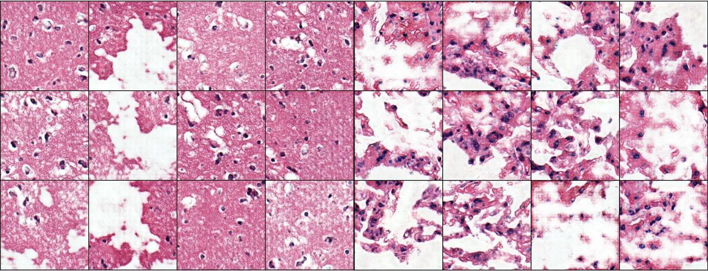

# Synthetic whole-slide imaging tile generation using gene expression profiles and deep generative models

---

## Abstract

Whole-slide imaging is widely used as a diagnostic tool, by examining the morphological features of the tissue However, the acquisition and labelling of these images is a time-consuming process, and requires expert pathologists. Given these difficulties, the generation of synthetic biological data has increased in interest in recent years. Nevertheless, the majorities of the studies have been focused on generating a single modality, without leveraging the information provided by other related ones. In this work, we propose a new approach to generate hematoxylin and eosin stained healthy tissue tiles by using the gene expression profile of the patient. We firstly train a variational autoencoder that is able to learn the latent representation of the gene expression for multiple healthy tissues. Then, we compare the tiles generated by sampling from a random normal distribution or inputting the latent gene expression profile for healthy lung and brain cortex tissues using generative adversarial networks. The tiles generated using the gene expression profiles have an overall better quality over the others in fewer training epochs, and the model is able to generalize to gene expression profiles outside the training dataset. We show that the generated tiles can be used to train machine learning models in a toy problem example, and we present a web quiz where users can try to distinguish between real and generated tiles.



## Web quiz

A quiz is available to get a score on how well fake and real images are detected.

## Example usage

### betaVAE

**Training the model**

```bash
python3 betaVAE_training.py --seed 99 --config configs/betavae_tissues.json --log 1 --parallel 0
```
**Compute interpolation vectors**

```bash
python3 betaVAE_interpolation.py --seed 99 config --configs/betavae_tissues.json --log 0 --parallel 0
```
**Interpolating**

```bash
pythion3 betaVAE_sample.py --seed 99 --config configs/betavae_tissues.json --log 0 --parallel 0
```

### Normal GAN and RNA-GAN

**Normal GAN training**

```bash
python3 histopathology_gan.py --seed 99 --config configs/gan_run_brain.json --image_dir gan_generated_images/images_gan_brain --model_dir ./gan_models/gan_brain/gan_brain --num_epochs 39 --gan_type dcgan --loss_type wgan --num_patches 600

python3 histopathology_gan.py --seed 99 --config configs/gan_run_lung.json --image_dir gan_generated_images/images_gan_lung --model_dir ./gan_models/gan_lung/gan_lung --num_epochs 91 --gan_type dcgan --loss_type wgan --num_patches 600
```

**RNA-GAN training**

```bash
python3 histopathology_gan.py --seed 99 --config configs/gan_run_brain.json --image_dir gan_generated_images/images_rna-gan_brain --model_dir ./gan_models/rna-gan_brain/rna-gan_brain --num_epochs 24 --gan_type dcgan --loss_type wganvae --num_patches 600
python3 histopathology_gan.py --seed 99 --config configs/gan_run_lung.json --image_dir gan_generated_images/images_rna-gan_lung --model_dir ./gan_models/rna-gan_lung/rna-gan_lung --num_epochs 11 --gan_type dcgan --loss_type wganvae --num_patches 600
```

**Compute FID metrics**

```bash

```

**Image generation**

```bash
python3 generate_tissue_images.py --checkpoint ./checkpoints/rna-gan_lung.model --checkpoint2 ./checkpoints/gan_lung.model --config configs/gan_run_lung.json --sample_size 600 --vae --vae_checkpoint checkpoints/betavae.pt --patient1 GTEX-15RJ7-0625.svs

python3 generate_tissue_images.py --checkpoint ./checkpoints/rna-gan_brain.model --checkpoint2 ./checkpoints/gan_brain.model --config configs/gan_run_brain.json --sample_size 600 --vae --vae_checkpoint checkpoints/betavae.pt --patient1 GTEX-1C6WA-3025.svs

# From GEO series

python3 generate_tissue_image.py --checkpoint ./checkpoints/rna-gan_lung.model --config configs/gan_run_brain.json --sample_size 600 --vae --vae_checkpoint checkpoints/betavae.pt --rna_data GSE120795_lung_proteincoding.csv --random_patient

python3 generate_tissue_image.py --checkpoint ./checkpoints/rna-gan_brain.model --config configs/gan_run_brain.json --sample_size 600 --vae --vae_checkpoint checkpoints/betavae.pt --rna_data GSE120795_brain_proteincoding.csv --random_patient
```

**Training toy classification model**

```bash

# Using real samples
python3 wsi_model.py --patch_data_path images_form/ --csv_path real_toy_example.csv

# Using generated samples
python3 wsi_model.py --patch_data_path images_form/ --csv_path rna-gan_toy_example.csv
```

