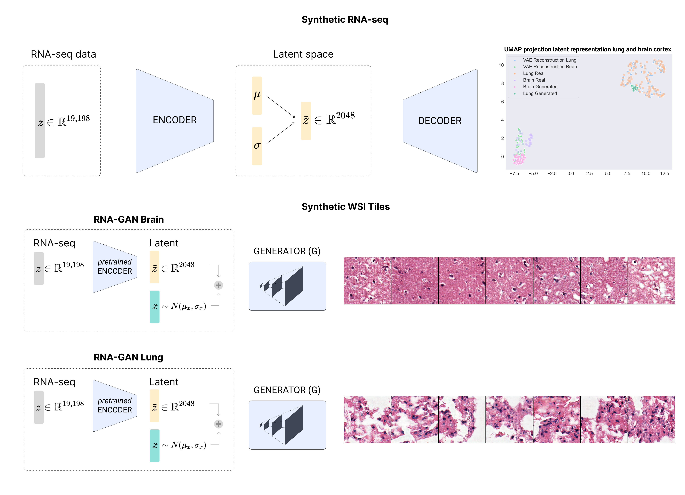

# Synthetic whole-slide imaging tile generation with gene expression profiles infused deep generative models

**Francisco Carrillo-Perez<sup>1,2</sup>, Marija Pizurica<sup>1,3</sup>, Michael G. Ozawa<sup>4</sup>, Hannes Vogel<sup>4</sup>, Robert B. West<sup>4</sup>, Christina S. Kong<sup>4</sup>, Luis Javier Herrera<sup>2</sup>, Jeanne Shen<sup>4</sup> and Olivier Gevaert<sup>1,5</sup>**

**<sup>1</sup> Stanford Center for Biomedical Informatics Research (BMIR), Stanford University, School of Medicine**

**<sup>2</sup> Computer Engineering, Automatics and Robotics Department, University of Granada**

**<sup>3</sup> Internet technology and Data science Lab (IDLab), Ghent University**

**<sup>4</sup> Department of Pathology, Stanford University, School of Medicine**

**<sup>5</sup> Department of Biomedical Data Science, Stanford University, School of Medicine**

---

The manuscript can be found in [Cell Reports Methods](https://www.cell.com/cell-reports-methods/fulltext/S2667-2375(23)00171-6).

## Abstract

The acquisition of multi-modal biological data such as RNA sequencing and whole slide imaging (WSI) for the same sample has increased in recent years, enabling studying human biology from multiple angles. However, despite these emerging multi-modal efforts, for the majority of studies only one modality is typically available due to financial or logistical constraints. Given these difficulties, multi-modal data imputation and multi-modal synthetic data are appealing as a solution for the multi-modal data scarcity problem. Currently, most studies focus on generating a single modality (e.g. WSI), without leveraging the information provided by additional data modalities (e.g. gene expression profiles). In this work, we propose an approach to generate WSI tiles by using deep generative models infused with matched gene expression profiles. First, we train a variational autoencoder (VAE) that learns a latent representation of multi-tissue gene expression profiles, and we show that this model is able to generate realistic synthetic gene expression. Then, we use this representation to infuse generative adversarial networks (GAN), generating lung and brain cortex tissue tiles with a new model that we call RNA-GAN. Tiles generated by RNA-GAN were preferred by expert pathologists in comparison to tiles generated using traditional GANs and RNA-GAN needs fewer training epochs to generate high-quality tiles. In addition, RNA-GAN was able to generalize to gene expression profiles outside of the training set and we show that the synthetic tiles can be used to train machine learning models. A web-based quiz is available for users to play a game distinguishing  real and synthetic tiles: [https://rna-gan.stanford.edu](https://rna-gan.stanford.edu) and the code for RNA-GAN is available: [https://github.com/gevaertlab/RNA-GAN](https://github.com/gevaertlab/RNA-GAN)



## Web quiz

A [quiz](https://rna-gan.stanford.edu) is available to get a score on how well fake and real images are detected.

## Checkpoints

Checkpoints for the models can be downloaded [here](https://drive.google.com/drive/folders/1aJcH8pDpjhQ1hz39aalrqgYRh4eH4Y_8?usp=sharing).

# Training the betaVAE model on the RNA-Seq data

Data needs to be downloaded from the [GTEx Portal](https://gtexportal.org/home/index.html). IDs are provided in the [ref_files](https://github.com/gevaertlab/RNA-GAN/tree/master/ref_files) folder. The JSON file configuration file is provided in the [config](https://github.com/gevaertlab/RNA-GAN/blob/master/configs/betavae_tissues.json) folder, along witht the protein coding genes identifiers. The genes expression values are expected to be in a CSV with the following columns:
- **wsi_file_name**: Name of the WSI file
- All protein code genes names with the 'rna_' prefix, as in the [protein_coding_genes.csv](https://github.com/gevaertlab/RNA-GAN/blob/master/ref_files/protein_coding_genes.csv) file.

Once the files are available for all tissues (lung, brain, liver, stomach, and pancreas). The betaVAE can be trained as follows:

```bash
python3 betaVAE_training.py --seed 99 --config configs/betavae_tissues.json --log 1 --parallel 0
```

Once the model has been trained, the interpolation experiments can be performed, by firstly computing the interpolation vectors between two classes:

```bash
python3 betaVAE_interpolation.py --seed 99 config --configs/betavae_tissues.json --log 0 --parallel 0
```

,and then interpolating samples or generating new ones:

```bash
pythion3 betaVAE_sample.py --seed 99 --config configs/betavae_tissues.json --log 0 --parallel 0
```

# Training the GAN model on WSI tiles

WSI files in SVS format need to be downloaded from the [GTEx Portal](https://gtexportal.org/home/index.html). IDs are provided in the [ref_files](https://github.com/gevaertlab/RNA-GAN/tree/master/ref_files) folder, with one file per tissue. SVS files need to be placed in independent folders, and preprocessed using the [patch_gen_grid.py](https://github.com/gevaertlab/RNA-GAN/blob/master/src/preprocess/patch_gen_grid.py) file inside the ```src/preprocess``` folder. This script will create two folders: one containing the tiles and another one containing the tissue masks. Once the tiles have been obtained, we can proceeed with the GAN training both for lung and brain cortex tissue:

```bash
python3 histopathology_gan.py --seed 99 --config configs/gan_run_brain.json --image_dir gan_generated_images/images_gan_brain --model_dir ./checkpoints/gan_brain --num_epochs 39 --gan_type dcgan --loss_type wgan --num_patches 600

python3 histopathology_gan.py --seed 99 --config configs/gan_run_lung.json --image_dir gan_generated_images/images_gan_lung --model_dir ./checkpoints/gan_lung --num_epochs 91 --gan_type dcgan --loss_type wgan --num_patches 600
```

The path of the preprocessed tiles and the the csv files need to be specific in the json file inside the [configs](https://github.com/gevaertlab/RNA-GAN/tree/master/configs) folder.

Once the model has been trained, we can generate new images using the following command:

```bash
python3 generate_tissue_images.py --checkpoint ./checkpoints/gan_lung.model --config configs/gan_run_lung.json --sample_size 600
```

# Training the RNA-GAN model on WSI tiles

Since we have already preprocessed the tiles we can omit that step and train the RNA-GAN model directly as follows:

```bash
python3 histopathology_gan.py --seed 99 --config configs/gan_run_brain.json --image_dir gan_generated_images/images_rna-gan_brain --model_dir ./checkpoints/rna-gan_brain --num_epochs 24 --gan_type dcgan --loss_type wganvae --num_patches 600
python3 histopathology_gan.py --seed 99 --config configs/gan_run_lung.json --image_dir gan_generated_images/images_rna-gan_lung --model_dir ./checkpoints/rna-gan_lung --num_epochs 11 --gan_type dcgan --loss_type wganvae --num_patches 600
```

Once the model has been trained, we can generate new images with the following command:

```bash
python3 generate_tissue_images.py --checkpoint ./checkpoints/rna-gan_lung.model --config configs/gan_run_lung.json --sample_size 600 --vae --vae_checkpoint checkpoints/betavae_tissues.pt --patient1 GTEX-15RJ7-0625.svs

python3 generate_tissue_images.py --checkpoint ./checkpoints/rna-gan_brain.model --config configs/gan_run_brain.json --sample_size 600 --vae --vae_checkpoint checkpoints/betavae_tissues.pt --patient1 GTEX-1C6WA-3025.svs
```

# Generalization experiments over the GEO series

Data needs to be downloaded from the [GEO serie](https://www.ncbi.nlm.nih.gov/geo/query/acc.cgi?acc=GSE120795), and select the protein coding genes provided [here](https://github.com/gevaertlab/RNA-GAN/blob/master/ref_files/protein_coding_genes.csv). If the gene is not available, the value is set to zero. Then, we can use the RNA-GAN checkpoint to generate new synthetic tiles:

```bash
python3 generate_tissue_image.py --checkpoint ./checkpoints/rna-gan_lung.model --config configs/gan_run_brain.json --sample_size 600 --vae_checkpoint checkpoints/betavae_tissues.pt --rna_file GSE120795_lung_proteincoding.csv --random_patient

python3 generate_tissue_image.py --checkpoint ./checkpoints/rna-gan_brain.model --config configs/gan_run_brain.json --sample_size 600 --vae_checkpoint checkpoints/betavae_tissues.pt --rna_file GSE120795_brain_proteincoding.csv --random_patient
```

# Compute FID metrics

To compute the FID metric we used the pytorch-fid library that can be installed using pip ```pip3 install pytorch-fid```. It can be executed between real and synthetic images as follows:

```bash
echo "REAL vs GAN 60k"
python3 -m pytorch_fid real_tiles/ gan_tiles/ --device cuda:0

echo "REAL vs RNAGAN 60k"
python3 -m pytorch_fid real_tiles/ rnagan_tiles/ --device cuda:0
```

# ML experiment

For running the ML experiment for TCGA-GBM vs TCGA-LUAD classifitation, firstly you need to download the tiles from the [checkpoint](https://drive.google.com/drive/folders/1aJcH8pDpjhQ1hz39aalrqgYRh4eH4Y_8?usp=sharing) folder. Then, modify the csv file found in the [ref_file](https://github.com/gevaertlab/RNA-GAN/blob/master/ref_files/wsi_tiles_real.csv) accordingly, and run the following commands:

```bash
python3 ml_experiments.py --csv_path ../ref_files/wsi_tiles_real.csv --save_dir /path/to/save/dir/ --use_pretrain # using pretrained weights
python3 ml_experiments.py --csv_path ../ref_files/wsi_tiles_real.csv --save_dir /path/to/save/dir/ # training from scratch
```

# Requirements and versions

Requirements could be installed by using pip:

```
pip install -r requirements.txt
```

They should take approximately 30 minutes.

This software has been tested on CentOS Linux release 7.9.2009, and tested on Nvidia Geforce GTX 2080, and Nvidia Tesla P40 GPUs.

No non-standard hardware is required.

# Citation

If you find this work useful for your research, please cite as follows:

```
@article{carrillo-perez2023synthetic,
title = {Synthetic whole-slide image tile generation with gene expression profile-infused deep generative models},
journal = {Cell Reports Methods},
pages = {100534},
year = {2023},
issn = {2667-2375},
doi = {https://doi.org/10.1016/j.crmeth.2023.100534},
url = {https://www.sciencedirect.com/science/article/pii/S2667237523001716},
author = {Francisco Carrillo-Perez and Marija Pizurica and Michael G. Ozawa and Hannes Vogel and Robert B. West and Christina S. Kong and Luis Javier Herrera and Jeanne Shen and Olivier Gevaert},
```
